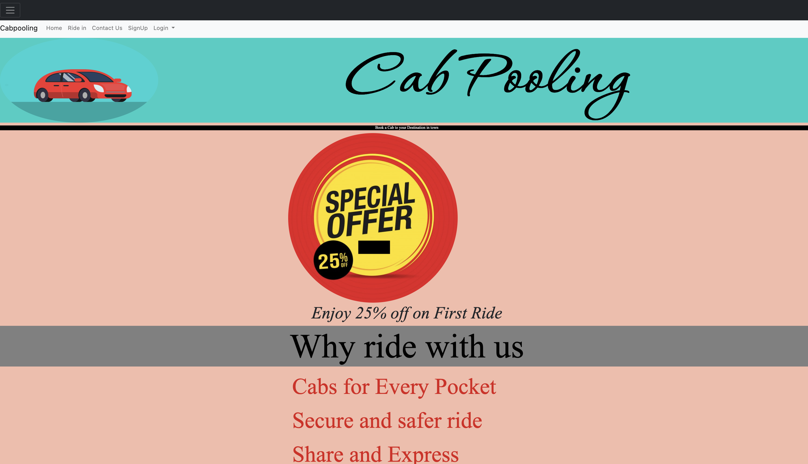
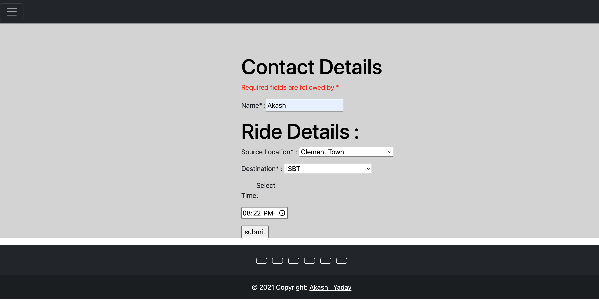

# Cab-Pooling-Project
The objective of our cab pooling website is to provide a convenient and cost-effective mode of transportation for daily commuters. By connecting individuals who share similar routes, we aim to reduce traffic congestion and carbon footprint while promoting social interaction among passengers. Our website also aims to improve the accessibility of public transportation by providing a reliable and easy-to-use platform for booking rides.

# Description
Our cab pooling website is designed to cater to the needs of daily commuters who are looking for a comfortable, affordable, and eco-friendly mode of transportation. The website allows users to create profiles, input their starting and destination points, and search for potential matches in their area. 

Our cab pooling website aims to make daily commuting convenient, comfortable, and sustainable while reducing traffic congestion and promoting social interaction among passengers.
# Website 

# Ride In Page

# Languages Used
HTML for front-end development.  
CSS for beautification.  
PHP for back-end development.

# Sources
W3School : https://www.w3schools.com/      
Youtube : https://www.youtube.com/              
Bootstrap : https://getbootstrap.com/.  
